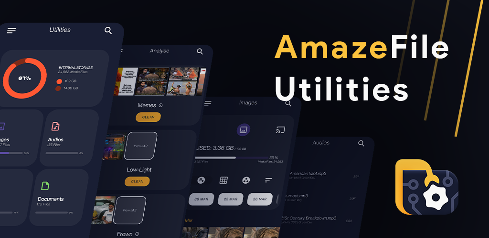

# <a href="https://teamamaze.xyz">Amaze File Utilities</a>

</img>
&nbsp;

## Overview

</img>

From the developers of open source app Amaze File Manager. An open source app to view, manage and analyse internal storage media files with built-in media players, without any ads and with a beautiful UI.  
An open source alternative to Google Files android app.

Analyse:
- Analyse storage for junk files to delete
- Group similar images, memes, low-light images, blurred images, selfies or group images
- Group large, duplicate or hidden files in storage
- Group cluttered media files (uses algorithms to identify videos that may not be useful)
- Group old downloads, recordings or screenshots
- Group unused / most used / least used installed apps, large apps or games, apps that use most data
- Group Whatsapp / Telegram media files
- Group apps that use most Mobile / Wifi network data
- Clean junk data of uninstalled apps
- Group list of apps growing in size
- Group apk files in storage that may not be useful
- Clear RAM for better performance
- Compress media files

Media Files:
- View / group / sort in list or grid
- Delete / share / go to location
- Open using inbuilt player
- Jump to any date instantly
- Search for any media file instantly
- Compress images / video files
- Cast on tv

Music Player:
- Shuffle, play on repeat
- View waveform data for better insight of song
- Change playback pitch or speed
- Add, remove songs to playlists
- Search for lyrics online, play along with the song

Video Player:
- Play videos with gestures to skip, manage volume, brightness within player
- View in picture-in-picture mode
- Supports gesture to play, pause, skip, change brightness or volume within player
- Play in background or PIP (picture-in-picture) window
- Lock gestures or orientation
- Search and download online subtitles within player
- Change playback aspect ratio, pitch and speed
- Compress videos to save data

Image Viewer:
- View, share or delete images
- Edit using inbuilt image editor
- Add stickers, text, rotate, crop or draw over images
- View image histogram or other metadata
- Compress images to save data

Document Viewer:
- View pdf, epub, docx, xps, oxps, cbz, fb2 and mobi files using inbuilt viewer
- Search for text in viewer
- Switch between dark or light mode in pdf viewer
- Bookmark a page in your epub digital book

Transfer:
- Transfer data between devices through wifi p2p
- High transfer speeds using android Wifi-direct

Trash bin (Recycle bin):
- Delete files temporarily to recycle bin 
- Restore / delete permanently based on max number of files / maximum days / maximum size

Contact:
Telegram - https://t.me/AmazeFileManager

Issue tracker:
https://github.com/TeamAmaze/AmazeFileUtilities-Issue-Tracker/issues

Note: This app is trial based and requires a nominal donation to unlock full version.

## Downloads

Or download the latest APK from the [Releases Section](https://github.com/TeamAmaze/AmazeFileUtilities/releases/latest).

## Contribute

You can contribute via one of the following ways:
- Help us with the translations of either [Amaze File Manager](https://www.transifex.com/amaze/amaze-file-manager/) or [Amaze Utilities](https://crowdin.com/project/amaze-file-utilities)
- [Contribute](https://github.com/TeamAmaze/AmazeFileManager/blob/release/4.0/CONTRIBUTING.md) directly to the code, help us in fixing the bugs / implement new features.

_If we feel your contribution is a significant help to us, we'll award you a bounty with any of your preferred mode of payment._

## Support

  
Or buy the [Cloud Plugin](https://play.google.com/store/apps/details?id=com.filemanager.amazecloud) supports Google Drive™, Dropbox, OneDrive and Box accounts.

## Warning

***Under the license we are not responsible for damages.***

See our [Privacy Policy](https://teamamaze.xyz/privacy-policy-utilities)

## Translators

Want to help translate Amaze to your language?

See [Crowdin](https://crowdin.com/project/amaze-file-utilities).

## Vendors/Developers

The device vendors/ROM developers are free to include Amaze apk pre-installed in system. There is no fee required; *but you must comply with the license* (for more information read the [GNU GPL v3](https://www.gnu.org/licenses/gpl-3.0.en.html) or newer).

We strongly recommend using apk signed by us (either Play Store version or from AFH link above) so that users would be able to update directly from Play Store after distribution. Furthermore, a change in digital signature will break plug-ins.

## License:
Amaze File Utilities is licenced under [GPLv3](https://teamamaze.xyz/license-agreement-utilities) and anyone wanting to use it (as a base for your own project or even use some of its parts or features) has to adhere to this license completely. Make sure that you are aware of all the licensing terms before creating your own project based on Amaze Utilities.

Here some important points to keep in mind, as to how we handle licensing:

- You cannot simply rename our app, strip it of all credit and upload it anywhere as your own, be this with or without monetization.
- You have to make changes in terms of design, features, etc before publishing it anywhere. Changing app name, package name and logo is not enough.
- You are required to give us full credits for any work you may be using from us.
- We will ALWAYS use all our legal options, if you do not strictly adhere to these licencing terms.

    Copyright (C) 2021-2024 Arpit Khurana <arpitkh96@gmail.com>
    Copyright (C) 2021-2024 Vishal Nehra <vishalmeham2@gmail.com>
    Copyright (C) 2021-2024 Emmanuel Messulam <emmanuelbendavid@gmail.com>
    Copyright (C) 2021-2024 Raymond Lai <airwave209gt at gmail.com>
    This file is part of Amaze File Utilities.
    Amaze File Utilities is free software: you can redistribute it and/or modify
    it under the terms of the GNU General Public License as published by
    the Free Software Foundation, either version 3 of the License, or
    (at your option) any later version.
    This program is distributed in the hope that it will be useful,
    but WITHOUT ANY WARRANTY; without even the implied warranty of
    MERCHANTABILITY or FITNESS FOR A PARTICULAR PURPOSE.  See the
    GNU General Public License for more details.
    You should have received a copy of the GNU General Public License
    along with this program.  If not, see <http://www.gnu.org/licenses/>.

